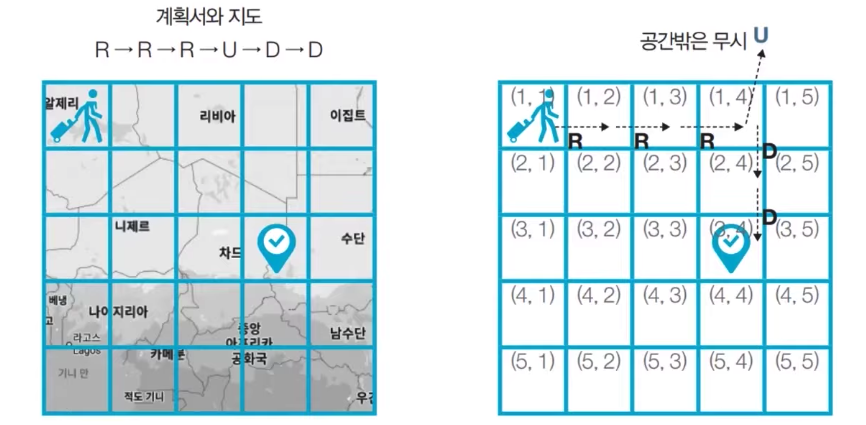

# Implementation(구현)
* 머릿속에 있는 알고리즘을 소스코드로 바꾸는 과정
* 문제를 마주쳤을때, 생각하여 해답을 내놓는 과정
* 변수 타입의 최소, 최대 크기를 고려
* 채점시 메모리와 시간을 고려하여, 복잡도를 생각.
* 문항이 긴편이긴 하지만, 고차원적인 사고력을 요구하지는 않는 편.
* 따라서 최대한 빠르게 읽어 알고리즘을 머릿속에서 생각해내는게 중요함.

## 상하좌우
```
여행가 A는 N * N 크기의 정사각형 공간 위에 서 있다. 이 공간은 1 * 1 크기의 정사각형으로 나누어져 있다. 가장 왼쪽 위 좌표는 (1, 1)이며, 가장 오른쪽 아래 좌표는 (N, N)에 해당한다. 여행가는 A는 상, 하, 좌, 우 방향으로 이동할 수 있으며, 시작 좌표는 항상 (1, 1)이다. 우리 앞에는 여행가 A가 이동할 계획이 적힌 계획서가 놓여 있다.

계획서 하나의 줄에 띄어쓰기를 기준으로 하여 L, R, U, D 중 하나의 문자가 반복적으로 적혀있다. 각 문자의 의미는 다음과 같다.

L: 왼쪽으로 한 칸 이동
R: 오른쪽으로 한 칸 이동
U: 위로 한 칸 이동
D: 아래로 한 칸 이동

이때 여행가 A가 N * N 크기의 정사각형 공간을 벗어나는 움직임은 무시된다. 예를 들어 (1, 1)의 위치에서 L 혹은 U를 만나면 무시된다. 다음은 N = 5인 지도와 계획서이다.

1)

이 경우 6개의 명령에 따라서 여행가가 움직이게 되는 위치는 순서대로 (1, 2), (1, 3), (1, 4), (1, 4), (2, 4), (3, 4) 이므로, 최종적으로 여행가 A가 도착하게 되는 곳의 좌표는 (3, 4)이다. 다시 말해 3행 4열의 위치에 해당하므로 (3, 4)라고 적는다. 계획서가 주어졌을 때 여행가 A가 최종적으로 도착할 지점의 좌표를 출려력하는 프로그램을 작성하시오.
```

1) 

### 입력 조건
* 첫째 줄에 공간의 크기를 나타내는 N이 주어진다. (1 <= N <= 100)
* 둘째 줄에 여행가 A가 이동할 계획서 내용이 주어진다. (1 <= 이동 횟수 <= 100)

### 출력 조건
* 첫째 줄에 여행가 A가 최종적으로 도착할 지점의 좌표 (X, Y)를 공백으로 구분하여 출력한다.

### 입력 예시
```
5
R R R U D D
```

### 출력 예시
`3 4`

### 풀이
```Swift
func implement1(size: Int, wayString: String) -> String {
    var x = 0
    var y = 0
    for way in wayString.split(separator: " ") {
        switch way {
        case "L" where y > 0: y -= 1
        case "R" where y < size: y += 1
        case "U" where x > 0: x -= 1
        case "D" where x < size: x += 1
        default: break
        }
    }
    
    return "\(x + 1) \(y + 1)"
}
```

## 시각
```
정수 N이 입력되면 00시 00분 00초부터 N시 59분 59초까지의 모든 시각중에서 3이 하나라도 포함되는 모든 경우의 수를 구하는 프로그램을 작성하시오. 예를 들어 1을 입력했을 때 다음은 3이 하나라도 포함되어 있으므로 세어야 하는 시각이다.
  * 00시 00분 03초
  * 00시 13분 30초

반면에 다음은 3이 하나도 포함되어 있지 않으므로 세면 안되는 시각이다.
  * 00시 02분 55초
  * 01시 27분 45초
```

### 입력 조건
* 첫째 줄에 정수 N이 입력된다. (0 <= N <= 23)

### 출력 조건
* 00시 00분 00초부터 N시 59분 59초까지의 모든 시각 중에서 3이 하나라도 포함되는 모든 경우의 수를 출력한다.

### 입력 예시
`5`

### 출력 예시
`11475`

### 풀이
```Swift
func implement2_1(number: Int) -> Int {
    var count = 0
    for hour in 0 ... number {
        for minute in 0 ..< 60 {
            for second in 0 ..< 60 {
                if hour / 10 == number || hour % 10 == number || hour == number ||
                    minute / 10 == number || minute % 10 == number || minute == number ||
                    second / 10 == number || second % 10 == number || second == number
                {
                    count += 1
                }
            }
        }
    }
    
    return count
}

func implement2_2(number: Int) -> Int {
    var count = 0
    
    for hour in 0 ... number {
        if hour / 10 == number || hour % 10 == number || hour == number {
            count += 3600
            continue
        }
        for minute in 0 ..< 60 {
            if minute / 10 == number || minute % 10 == number || minute == number {
                count += 60
                continue
            }
            for second in 0 ..< 60 {
                if second / 10 == number || second % 10 == number || minute == number {
                    count += 1
                }
            }
        }
    }
    
    return count
}

func implement2_3(number: Int) -> Int {
    var count = 0
    for h in 0 ... number {
        for m in 0 ..< 60 {
            for s in 0 ..< 60 {
                if String(format:"%02i:%02i:%02i", h, m, s).contains("\(number)") { count += 1 }
            }
        }
    }
    
    return count
}
```

## 왕실의 나이트
```
행복 왕국의 왕실 정원은 체스판과 같은 8 * 8 좌표 평면이다. 왕실 정원의 특정한 한 칸에 나이트가 서 있다. 나이트는 매우 충성스러운 신하로서 매일 무술을 연마한다.

나이트는 말을 타고 있기 때문에 이동을 할 때는 L자 형태로만 이동할 수 있으며 정원 밖으로는 나갈 수 없다. 나이트는 특정한 위치에서 다음과 같은 2가지 경우로 이동할 수 있다.

  1. 수평으로 두 칸 이동한 뒤에 수직으로 한 칸 이동하기.
  2. 수직으로 두 칸 이동한 뒤에 수평으로 한 칸 이동하기.

이처럼 8 * 8 좌표 평면상에서 나이트의 위치가 주어졌을 때 나이트가 이동할 수 있는 경우의 수를 출력하는 프로그램을 작성하시오. 이때 왕실의 정원에서 행 위치를 표현할 때는 1부터 8로 표현하며, 열 위치를 표현할 때는 a부터 h로 표현한다.

예를 들어 만약 나이트가 a1에 있을 때 이동할 수 있는 경우의 수는 다음 2가지이다. a1의 위치는 좌표 평면에서 구석의 위치에 해당하며 나이트는 정원의 밖으로는 나갈 수 없기 때문이다.

  1. 오른쪽으로 두 칸 이동 후 아래로 한 칸 이동하기(c2)
  2. 아래로 두 칸 이동 후 오른쪽으로 한 칸 이동하기(b3)

또 다른 예로 나이트가 c2에 위치해 있다면 나이트가 이동할 수 있는 경우의 수는 6가지이다. 이건 직접 계산해 보시오.
```

### 입력 조건
* 첫째 줄에 8 * 8 좌표 평먼상에서 현재 나이트가 위치한 곳의 좌표를 나타내는 두 문자로 구성된 문자열이 입력된다. 입력 문자는 a1처럼 열과 행으로 이뤄진다.

### 출력 조건
* 첫째 줄에 나이트가 이동할 수 있는 경우의 수를 출력하시오.

### 입력 예시
`a1`

### 출력 예시
`2`

### 풀이
```Swift
func implement3(_ startPoint: String) -> Int {
    var count = 8
    let startPointCharArray = Array(startPoint) // 입력받은 문자열을 배열 캐릭터로 나눔.
    var points = [Int]()
    
    let max = 7
    
    for point in startPointCharArray {
        // x와 y의 조건이 같기때문에, x, y의 구분은 필요하지 않음. 따라서 2칸의 배열로 처리.
        // 1~8 / A~H 의 좌표계로 되어있지만, 로직은 가로 세로 둘다 0~7을 이용.
        // 해당 캐릭터가 숫자인지 확인 후 숫자라면 숫자로 변환, 아니라면 문자로 변환.
        // 그런데 소문자 a의 아스키코드값은 97이므로, 97을 빼준다. 따라서 a는 0, h는 7이됨.
        points.append(
            point.isWholeNumber ? Int(point.wholeNumberValue!) - 1 : Int(point.asciiValue!) - 97
        )
    }
    
    // 핵심 로직은 이렇게 접근함.
    // "2칸 전진 후 좌우 확인."
    // 2칸 전진이 되지 않는다면, 좌우확인도 되지 않는다. 따라서 좌, 우 1개의 경우의수를 놓치기 때문에, 2칸 전진이 되지 않는다면 2개의 경우의수가 날아간다.
    // 2칸전진이 되는데, 좌측 혹은 우측으로 진입이 되지 않는다면 1개의 경우의수가 날아간다.
    // 4방향이기때문에, 모든 경우의수는 8가지다. 그래서 count를 8에서 빼가는 역계산을 하는 것.
    // 아래 로직은, 주석에 있는 방법을 반복문으로 변환한것이다.
    // if x - 2 < 0 { count -= 2 }
    // if x + 2 > 7 { count -= 2 }
    // if x - 1 < 0 { count -= 1 }
    // if x + 1 > 7 { count -= 1 }
    // if y - 2 < 0 { count -= 2 }
    // .
    // .
    // .
    // if y + 1 > 7 { count -= 1 }
    // 위 코드를 x, y가 아닌 2개의 좌표배열, 그리고 반복문으로 실행하면 이런 로직이 완성된다.
    for point in points {
        for value in 1 ... 2 where point - value < 0 || point + value > max {
            count -= value
        }
    }
    
    return count
}

func implement3_1(_ startPoint: String) -> Int {
    var count = 8
    let startPointCharArray = Array(startPoint) // 입력받은 문자열을 배열 캐릭터로 나눔.
    var points = [Int]()
    
    let max = 7
    
    for point in startPointCharArray {
        points.append(
            point.isWholeNumber ? Int(point.wholeNumberValue!) - 1 : Int(point.asciiValue!) - 97
        )
    }
    
    for point in points {
        for value in 1 ... 2 where point - value < 0 || point + value > max {
            count -= value
        }
    }
    
    return count
}
```

## 게임 개발
```
현민이는 게임 캐릭터가 맵 안에서 움직이는 시스템을 개발 중이다. 캐릭터가 있는 장소는 1 * 1 크기의 정사각형으로 이뤄진 N * M 크기의 직사각형으로, 각각의 칸은 육지 또는 바다이다. 캐릭터는 동서남북 중 한 곳을 바라본다.

맵의 각 칸은 (A, B)로 나타낼 수 있고, A는 북쪽으로부터 떨어진 칸의 개수, B는 서쪽으로부터 떨어진 칸의 개수이다. 캐릭터는 상하좌우로 움직일 수 있고, 바다로 되어 있는 공간에는 갈 수 없다.

캐릭터의 움직임을 설정하기 위해 정해 놓은 매뉴얼은 이러하다.

  1. 현재 위치에서 현재 방향을 기준으로 왼쪽 방향(반시계 방향으로 90도 회전한 방향)부터 차례대로 갈 곳을 정한다.
  2. 캐릭터의 바로 왼쪽 방향에 아직 가보지 않은 칸이 존재한다면, 왼쪽 방향으로 회전한 다음 왼쪽으로 한칸을 전진한다. 왼쪽 방향에 가보지 않은 칸이 없다면, 왼쪽 방향으로 회전만 수행하고 1단계로 돌아간다.
  3. 만약 네방향 모두 이미 가본 칸이거나 바다로 되어 있는 칸인 경우에는, 바라보는 방향을 유지한 채로 한 칸 뒤로 가고 1단계로 돌아간다, 단, 이때 뒤쪽 방향이 바다인 칸이라 뒤로 갈 수 없는 경우에는 움직임을 멈춘다.

현민이는 위 과정을 반복적으로 수행하면서 캐릭터의 움직임에 이상이 있는지 테스트하려고 한다.
매뉴얼에 따라 캐릭터를 이동시킨 뒤에, 캐릭터가 방문한 칸의 수를 출력하는 프로그램을 만드시오.
```

### 입력 조건
* 첫째 줄의 맵의 세로 크기를 N과 가로크기 M을 공백으로 구분하여 입력한다. (3 <= N, M <= 50)
* 둘째 줄에 게임 캐릭터가 있는 칸의 좌표 (A, B)와 바라보는 방향 d가 각각 서로 공백으로 구분하여 주어진다. 방향 d의 값으로는 다음과 같이 4가지가 존재한다
  * 0: 북쪽
  * 1: 동쪽
  * 2: 남쪽
  * 3: 서쪽
* 셋째 줄부터 맵이 육지인지 바다인지에 대한 정보가 주어진다. N개의 줄에 맵의 상태가 북쪽부터 남쪽 순서대로, 각 줄의 데이터는 서쪽부터 동쪽 순서대로 주어진다. 맵의 외곽은 항상 바다로 되어 있다.
  * 0: 육지
  * 1: 바다
* 처음에 게임 캐릭터가 위치한 칸의 상태는 항상 육지이다.

### 출력 조건
* 첫째 줄에 이동을 마친 후 캐릭터가 방문한 칸의 수를 출력한다.

### 입력 예시
```
4 4      # 4 * 4 맵 생성
1 1 0    # (1, 1)에 북쪽(0)을 바라보고 서 있는 캐릭터
1 1 1 1  # 첫 줄은 모두 바다
1 0 0 1  # 둘째 줄은 바다 / 육지 / 육지 / 바다
1 1 0 1  # 셋째 줄은 바다 / 바다 / 육지 / 바다
1 1 1 1  # 넷째 줄은 모두 바다
```

## 출력 예시
`3`

### 풀이
```Swift
class CharacterPoint {
    enum Cardinal: Int {
        case n = 0
        case e = 1
        case s = 2
        case w = 3
    }
    
    
    var x = 0
    var y = 0
    var direction = Cardinal.n
    
    init(_ startPoint: String) {
        self.x = Int(startPoint.split(separator: " ")[0])!
        self.y = Int(startPoint.split(separator: " ")[1])!
        self.direction = Cardinal(rawValue: Int(startPoint.split(separator: " ")[2])!)!
    }
    
    func turn() -> Cardinal {
        var value = self.direction.rawValue
        value = value == 0 ? 3 : value - 1
        self.direction = Cardinal(rawValue: value)!
        
        return self.direction
    }
}

func stringsToMap(_ points: [String]) -> [[Int]] {
    var map = [[Int]]()
    
    for point in points {
        var row = [Int]()
        point.split(separator: " ").forEach { row.append(Int($0)!) }
        map.append(row)
    }
    
    return map
}


func implement4(_ size: String, _ startPoint: String, _ points: String...) -> Int {
    var count = 1
    
    let maxX = Int(size.split(separator: " ")[0])!
    let maxY = Int(size.split(separator: " ")[0])!
    
    let point = CharacterPoint(startPoint)
    
    var map = stringsToMap(points)
    
    var directionCount = 0
    
    var target = (0, 0)
    
    while true {
        _ = point.turn()
        directionCount += 1
        target = (point.y, point.x)
        switch point.direction {
        case .n: target.0 -= 1
        case .e: target.1 += 1
        case .s: target.0 += 1
        case .w: target.1 -= 1
        }
        if target.1 >= 0, target.1 < maxX,
           target.0 >= 0, target.0 < maxY {
            if map[target.0][target.1] == 0 {
                map[target.0][target.1] = 2 // 방문지역은 2로 처리
                map[point.y][point.x] = 2 // 현재 지역, 방문이 확정된 지역 둘 다 2로 처리
                point.y = target.0
                point.x = target.1
                count += 1
                directionCount = 0
                continue
            }
        }
        
        if directionCount > 3 { // 4번 다 돌았을때
            target = (point.y, point.x)
            switch point.direction { // 현재 위치에서 뒤로 가기 때문에 역으로 계산
            case .n: target.0 += 1
            case .e: target.1 -= 1
            case .s: target.0 -= 1
            case .w: target.1 += 1
            }
            
            if target.1 > 0, target.1 < maxX,
               target.0 > 0, target.0 < maxY {
                if map[target.0][target.1] == 1{ // 바다면 멈춤
                    break
                } else { // 방문지역이라면 일단 거기로 가봄
                    point.y = target.0
                    point.x = target.1
                    directionCount = 0
                }
            }
        }
    }
    
    return count
}
```