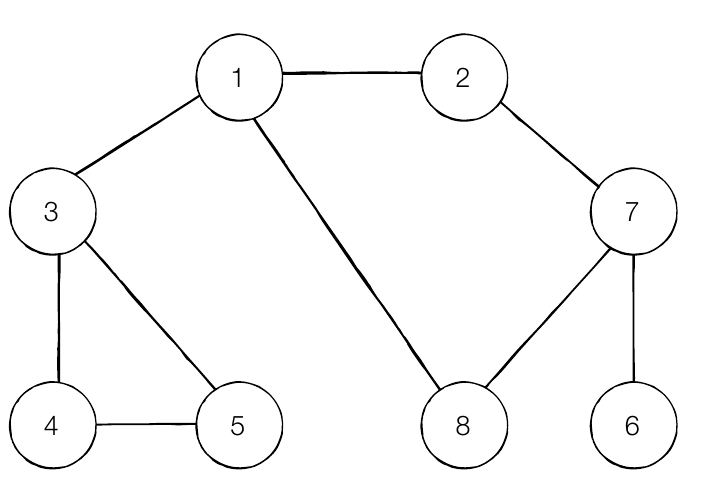

# 기초적인 자료구조

목차는 DFS / BFS로 구분되어있지만, 아주 기초적인 알고리즘을 함께 정리함.

## 스택과 큐


(출처 - [https://gohighbrow.com/stacks-and-queues/](https://gohighbrow.com/stacks-and-queues/))

데이터를 삽입하고, 순서에 따라 배출하는 자료구조.

배열과 비슷하지만, 자료들의 맨 뒤에 입력이 가능하며,

각 룰에 따라 출력이 가능한 자료구조이다.

Indexing하여 특정 요소에 접근할 수 없다.

### Stack

* 가장 마지막에 삽입한 자료를 순서로 출력하는 자료구조
  * LIFO (Last In, First Out)
* 입력할때는 `push`, 출력할때는 `pop` 이라는 키워드를 많이 사용한다.
* 출력할때는 배열처럼 요소를 가져오는게 아닌, 데이터를 반환 후 자료구조에서 삭제한다.
* 인터넷 브라우저의 이동과, iOS의 화면 네비게이션 이동에서 대표적으로 사용한다.


아래 예시처럼 간단하게 사용이 가능하다.

```Swift
var array = [1, 2, 3, 4, 5, 6, 7]

array.append(8) // push
array.popLast() // pop, Optional 타입이다.
```

직접 구현한다면, 다음과 같이 할 수 있다.

```Swift
struct Stack<T> {
    private var array = [T]()
    
    var isEmpty: Bool { array.count == 0 }

    mutating func pop() -> T? { array.popLast() }
    
    mutating func push(at: T) { array.append(at) }
}

var stack = Stack<Int>()
stack.push(at: 1)
stack.push(at: 2)
stack.push(at: 3)

print(stack.isEmpty)
print(stack.pop())
print(stack.pop())
print(stack.pop())
print(stack.isEmpty)
print(stack.pop())
```

### Queue

* 가장 먼저 삽입한 자료를 순서로 출력하는 자료구조
  * FIFO(First In, First Out)
* 스택과 내용이 동일하며, 출력의 순서만 다르다.
* 쓰레드처리, 네트워크 처리에서 많이 이용된다.


아래 예시처럼 간단하게 사용이 가능하다.

```Swift
var array = [1, 2, 3, 4, 5, 6, 7]

array.append(8) // push
array.first() // pop, Optional 타입이다.
```

직접 구현한다면, 다음과 같이 할 수 있다.

```Swift
struct Queue<T> {
    private var array = [T]()

    var isEmpty: Bool { array.count == 0 }
    
    mutating func pop() -> T? {
        if !self.isEmpty {
            return array.removeFirst()
        } else {
            return nil
        }
    }
    
    mutating func push(at: T) { array.append(at) }
}

var queue = Queue<Int>()
queue.push(at: 1)
queue.push(at: 2)
queue.push(at: 3)

print(queue.isEmpty)
print(queue.pop())
print(queue.pop())
print(queue.pop())
print(queue.isEmpty)
print(queue.pop())
```

## 재귀


* 자기 자신을 호출하는 함수.
* 대표적으로 아래 설명할 DFS / BFS에서 많이 사용되며, 수학의 프랙탈 구조와 유사하다.
* 재귀함수 사용 빈도에 따라, 공간 복잡도가 그만큼 늘어나게 된다.

## 탐색

* 자료구조에서 원하는 데이터를 찾아가는 행위
* 대표적으로 이진탐색, DFS, BFS 등이 있다.

아래와 같은 구조를 가지고 두가지의 탐색을 설명한다.


```Swift
var graph = [
    [], 
    [2, 3, 8], 
    [1, 7], 
    [1, 4, 5], 
    [3, 5], 
    [3, 4], 
    [7], 
    [2, 6, 8], 
    [1, 7]
]

```

### DFS (Depth First Search, 깊이 우선 탐색)

* 현재 진행하는 방향의 끝까지 탐색 후, 다른 방향을 탐색하는 방식.

현재 자신의 Depth를 하나씩 순회하기 이전에, 자신의 다음 Depth중 가장 먼저 있는것을 우선으로 탐색한다.

위 그래프대로 방향을 진행하게 된다면, 

`1 -> 2 -> 7 -> 6 -> 8 -> 3 -> 4 -> 5` 순서로 진행이 된다.

```Swift
func dfs(_ graph: inout [[Int]], _ visited: inout [Bool], _ depth: Int) {
    visited[depth] = true
    print(depth)
    for i in graph[depth] {
        if !visited[i] {
            dfs(&graph, &visited, i)
        }
    }
}

func start() {
    
    var graph = [
        [],
        [2, 3, 8],
        [1, 7],
        [1, 4, 5],
        [3, 5],
        [3, 4],
        [7],
        [2, 6, 8],
        [1, 7]
    ]
    
    var visited = [Bool](repeating: false, count: graph.count)
    
    dfs(&graph, &visited, 1)
}

start() // 1 2 7 6 8 3 4 5 출력
```

### BFS (Breadth First Search, 너비 우선 탐색)

* 현재 진행중인 선택지를 모두 탐색 후 다음 Depth를 탐색하는 방식.

현재 자신의 선택지를 모두 방문 후 다음 Depth중 가장 빠른 선택지를 우선으로 탐색한다.

위 그래프 방향을 진행하게 된다면,
`1 -> 2 -> 3 -> 8 -> 7 -> 4 -> 5 -> 6` 순서로 진행이 된다.

```Swift
func bfs(_ graph: [[Int]]) {
    print(1)
    var visited = [Bool](repeating: false, count: graph.count)
    for nodes in graph {
        for j in nodes {
            if !visited[j] {
                visited[j] = true
                print(j)
            }
        }
        
    }
}

func start() {
    
    var graph = [
        [],
        [2, 3, 8],
        [1, 7],
        [1, 4, 5],
        [3, 5],
        [3, 4],
        [7],
        [2, 6, 8],
        [1, 7]
    ]
    
    
    
    bfs(graph)
}

start()
```

## 문제 풀이
### 음료수 얼려먹기
```Swift
@discardableResult func dfs(_ mold: inout [[Int]], _ point: (Int, Int)) -> Bool {
    if point.0 <= -1 || point.0 >= mold.count || point.1 <= -1 || point.1 >= mold[0].count {
        return false
    }
    
    if mold[point.0][point.1] == 0 {
        mold[point.0][point.1] = 1
        dfs(&mold, (point.0 - 1, point.1))
        dfs(&mold, (point.0, point.1 - 1))
        dfs(&mold, (point.0 + 1, point.1))
        dfs(&mold, (point.0, point.1 + 1))
        return true
    } else {
        return false
    }
}

func solution(_ mold: [[Int]]) -> Int {
    var count = 0
    
    var mold = mold
    
    var visited = [[Bool]]()
    
    for arr in mold { visited.append([Bool](repeating: false, count: arr.count)) }
    
    for i in 0 ..< mold.count {
        for j in 0 ..< mold[i].count {
            if dfs(&mold, (i, j)) {
                count += 1
            }
        }
    }
    
    return count
}
```

### 미로 탈출
```Swift
func solution(_ map: [[Int]]) -> Int {
    var map = map
    let dx = [-1, 1, 0, 0]
    let dy = [0, 0, -1, 1]
    
    map.forEach { print($0) }
    
    var queue = [(Int, Int)]()
    queue.append((0, 0))
    
    while !queue.isEmpty {
        let newPoint = queue.removeFirst()
        
        for i in 0 ..< 4 {
            let nx = newPoint.0 + dx[i]
            let ny = newPoint.1 + dy[i]
            
            if nx < 0 ||
                ny < 0 ||
                nx >= map.count ||
                ny >= map[0].count ||
                map[nx][ny] == 0 {
                continue
            }
            
            if map[nx][ny] == 1 {
                map[nx][ny] = map[newPoint.0][newPoint.1] + 1
                queue.append((nx, ny))
            }
        }
    }
    
    map.forEach { print($0) }
    
    return map[map.count - 1][map[0].count - 1]
}

print(solution([
[1, 0, 1, 0, 1, 0],
[1, 1, 1, 1, 1, 1],
[0, 0, 0, 0, 0, 1],
[1, 1, 1, 1, 1, 1],
[1, 1, 1, 1, 1, 1],
]))

```

### 타겟 넘버
``` Swift
import Foundation

var results = [Int]()

func solution(_ numbers: [Int], _ target: Int) -> Int {    
    targetNumber_dfs(numbers, 0, 1)
    return (results.filter { $0 == target }).count
}

func targetNumber_dfs(_ numbers: [Int], _ value: Int, _ depth: Int) {
    if depth == numbers.count {
        results.append(value + numbers[depth - 1])
        results.append(value - numbers[depth - 1])
    } else {
        targetNumber_dfs(numbers, value + numbers[depth - 1], depth + 1)
        targetNumber_dfs(numbers, value - numbers[depth - 1], depth + 1)
    }
}
```