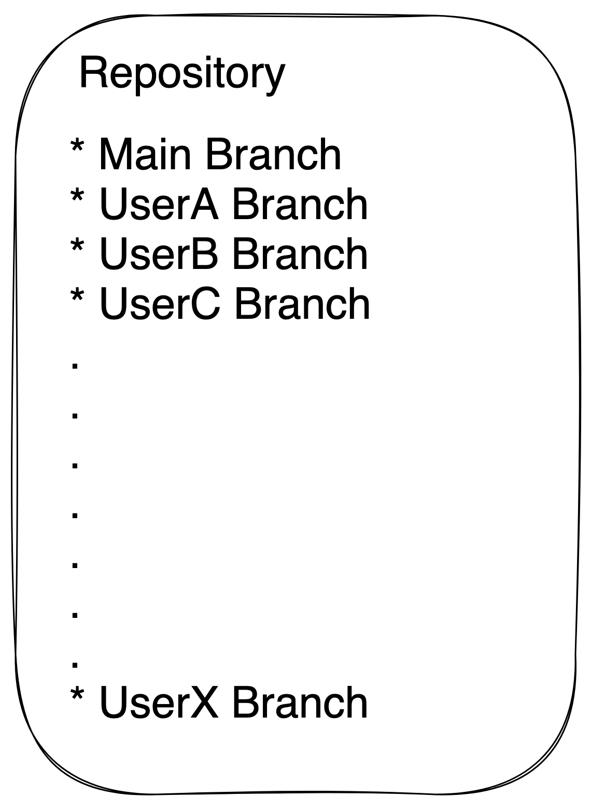
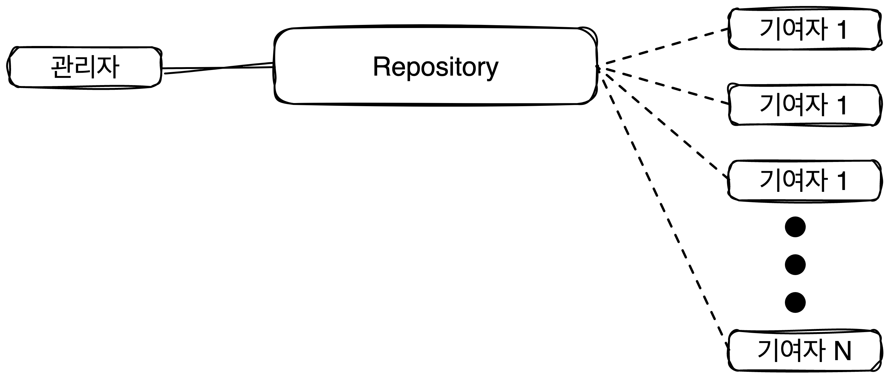
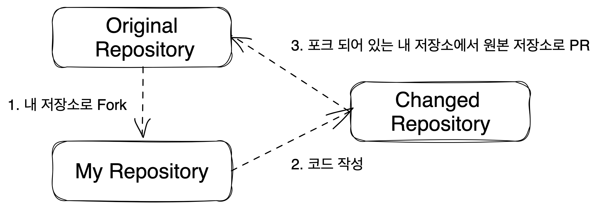
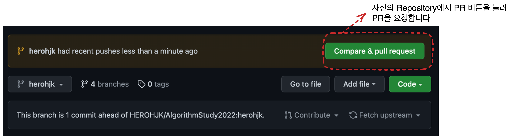
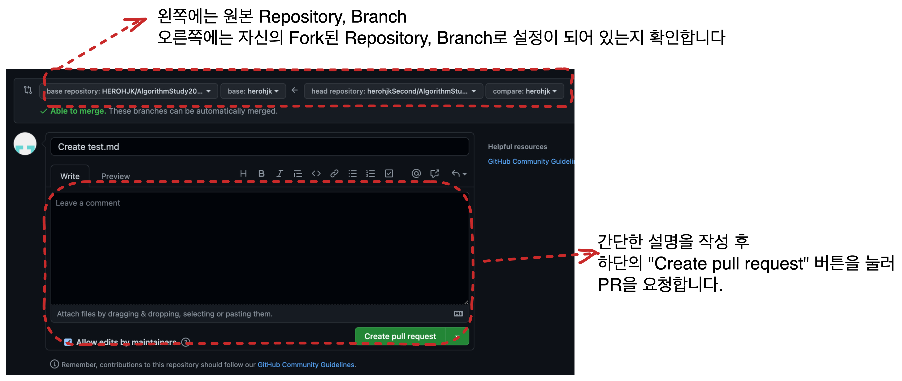

# 스터디 Repository 사용법

## 서론
우리는 다음과 같은 방식으로 Repository를 관리할 예정입니다.

이런 방식으로 사용하는 이유는 몇가지가 있습니다만, *PR을 활용하여 서로에 대한 코드를 리뷰해주는것이 가장 큰 목적*입니다.

하지만, 이런방식으로만 관리를 하게 된다면.. 개인의 github Repositories에는 저장이 되지 않습니다.

### PR?
PR은 Pull - Request의 줄임말로, github을 비롯한 많은 git Platform에서 사용중인 Merge 및 Code Review 방식입니다.

대략적으로 github의 Repository의 구성이 이렇다고 치면..

수정할 내용이 생겨서 기여자가 수정을 하게 될 때, 리뷰를 받고, 리뷰에 대해 승인을 받게 되면 그때 코드가 합쳐지는 방식입니다.
(요청 - 승인 없이 기여자 독단적으로 Repository의 코드를 수정한다면, 관리가 힘들게 되겠죠?)

따라서 이때 Pull - Request라는 방식으로 수정된 코드를 확인하고, 병합하는 과정을 거치는데요.

기여자가 수정할 코드를 PR 요청을 통해 요청을 한다면,

관리자는 해당 코드를 해당 Repository(기여자가 Fork하거나, 아니면 요청할때 임시로 생성된 저장소)를 Pull하여 확인합니다.

확인하는 과정이 일종의 Code Review가 되는것이죠.

## 방법

코드에 대한 기록은 다음과 같이 진행합니다.

**코드 수정 후 원본 저장소에 합쳐지기 까지..**

0. **(중요) 모든 작업은 자신의 Branch에서 작업합니다.**
1. 원본 저장소를 내 저장소로 포크합니다
    * 
2. 코드를 작성 및 수정합니다
3. 코드가 정리되었다면, PR을 요청합니다.
    * 
    * 
4. PR에 대한 승인은 원본 Repository의 Owner가 진행합니다.
